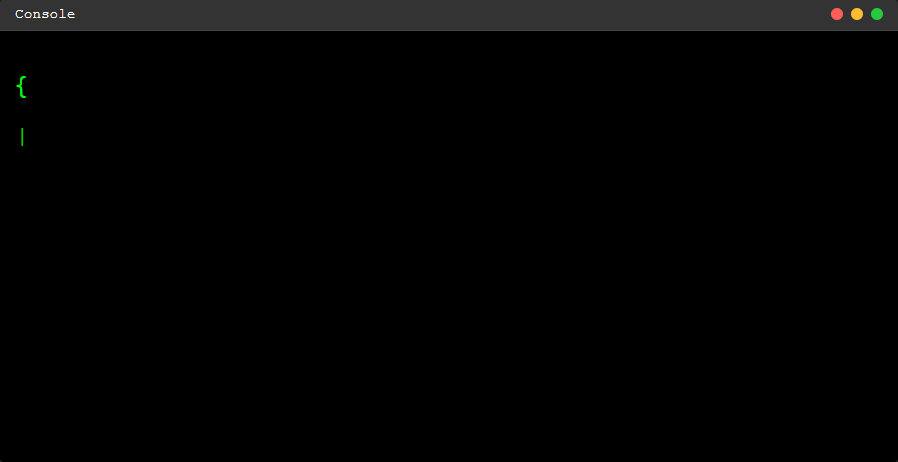

    

 
<h1></h1>

&nbsp;***About me***

**"Innovative Computer Engineer interested in Artificial Intelligence and Software Development."**

I am a passionate computer engineer with a strong foundation in programming, AI, and software development. With a Bachelor's degree from the University of Isfahan, I have cultivated expertise in machine learning, computer vision, and advanced programming. My academic journey and hands-on experiences, including impactful projects, have equipped me with the skills to design intelligent systems that solve real-world challenges.

As a dedicated learner, I aim to leverage my technical skills, creativity, and problem-solving abilities to contribute to innovative advancements in AI and software engineering.

Let’s connect to explore new opportunities and create the future of technology together.

 